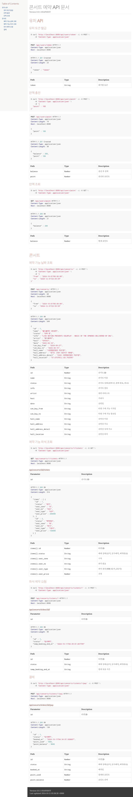

# 기본 패키지 구조
```
/config -> 각종 설정들(@Async 등)

/domain
	/concert -> 비즈니스 단위
		/usecase -> facade 패턴 대신 usecase 패턴 사용
			/dto -> controller 레이어와의 의존성을 낮춤 + service 는 비즈니스 로직에 집중 가능
			콘서트조회UseCase
			좌석조회UseCase
			...
		/service
		/repository -> 의존성을 느슨하게 하기 위해 interface 사용
			ConcertRepository
		/entity -> 고민?

/infrastructure
	/mysql
		/concert
			ConcertRepositoryImpl -> 서비스 레이어에서 명시한 인터페이스 구현
		  ConcertJPARepository  -> JPA 구현체
  /redis
	  
/interfaces
	/api  -> REST API
		/concert -> 비즈니스 단위
		  /dto -> Request/Response DTO
		  xxController  -> 컨트롤러
  /common -> ExceptionHandler
```
- 레이어드 아키텍처 + 클린 아키텍처(조금)
    - 의존성을 줄이기 위해 클린 아키텍처 방식을 조금 활용했습니다
- service 레이어의 infrastructure 레이어의 의존성 낮추기
    - 자주 생기는 패턴인 domain 레이어와 infrastructure 레이어의 의존성이 있습니다.
    - 이 관계를 느슨하게 하기 위해 domain 하위에 repository 의 interface 를 만들었습니다
    - 실제 구현은 infrastructure 레이어에서 진행함으로써 의존성을 낮추려고 해봤습니다
- Usecase 패턴(Facade 대체)
    - 2주차에 facade 패턴을 써본 결과 딱히 비즈니스 로직을 조합할 일이 없었습니다.
    - 이로인해 컨트롤러와 역할이 동등해졌고 코드 중복이 발생했습니다.
    - 또한 여러 서비스의 의존성이 생기니 코드 가독성이 떨어졌습니다.
    - 하지만 Facade 패턴을 사용하며 DTO 가 서비스 레이어와 분리되어 좋았습니다.
    - Usecase 패턴을 사용하여 서비스 의존성은 낮추고 DTO 를 분리시키기 위해서 적용해봤습니다.
- entity 고민
    - domain과 infrastructre 에 각각 entity 를 만들어서 쓰는게 의존성을 낮출 수 있지만
    - 실제로 같은 내용이 될 것이라 예상되어 괜한 중복이 될 것 같아 어떤 레이어에 둘지 고민입니다.

# 기술 스택
- Framework: Spring Boot MVC
- API 명세: Spring REST Docs
- Database: MySQL InnoDB + Redis 7
- 메세지 브로커: Kafka
- 가상머신: Docker
- 모니터링:  ELK
- 부하테스트: Apache JMeter
- CI/CD: 수동(시간되면 Jenkins)

# API 명세

