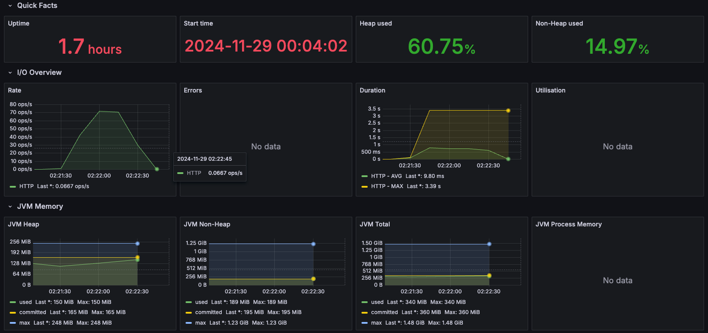
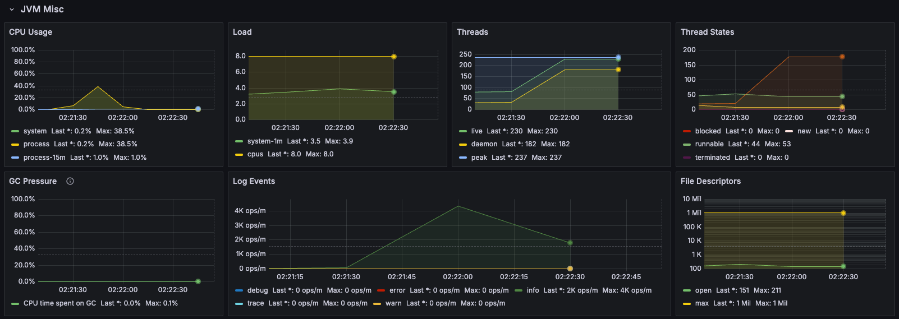
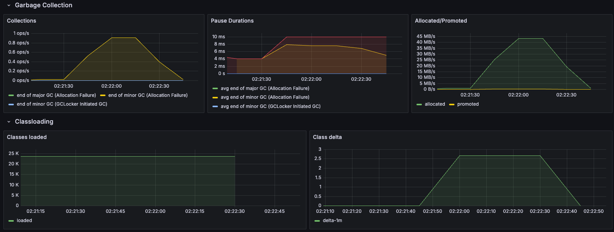
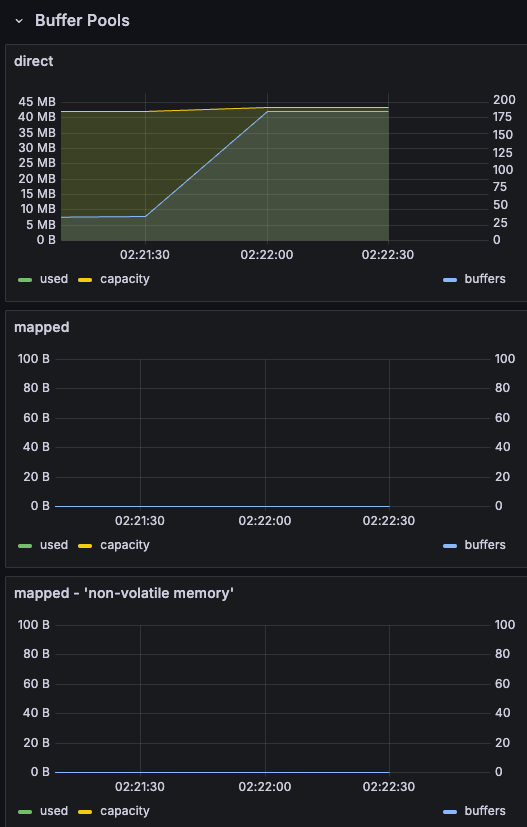

# JVM 분석

## JVM 성능 지표

## JVM 성능 분석
- I/O
  - 피크 70 ops/s 정도로 나옴
  - 예상대로 I/O 바운드가 많음
- Memory
  - Heap 메모리와 Non-Heap 메모리 사용률이 크게 변화지 않음
  - GC가 빈번하게 발생하지 않고 메모리 사용률도 적음
- CPU
  - CPU 사용률이 38.5% 까지 피크를 침
  - 부하테스트 결과와 일치되게 CPU 사용률이 급격하게 늘어남
  - CPU 바운드가 높음을 검증 완료
- Thread 수
  - live 쓰레드 수가 82개에서 230개로 늘어남
  - daemon 쓰레드 수가 34개에서 182개로 늘어남
  - daemon 이 live 와 비례하는 것으로 보아 정상 작동하지만 백그라운드 작업 비율이 높음을 알 수 있음
  - 쓰레드 수가 지속적으로 늘어나지 않는 것으로 보아 쓰레드 누수는 없는 것으로 보임
- Thread States
  - blocked 가 0개로 나타는 것으로 보아 데드락은 없는 것으로 보임
  - new 가 0개로 나타는 것으로 보아 새로 생긴 쓰레드는 놀고 있지 않는 것으로 보임
  - runnable 이 53개에서 44개로 줄어드고 계속 유지되는 것으로 보아 쓰레드 부족현상은 없어 보임
  - terminated 가 0개로 나타는 것으로 보아 쓰레드 종료현상은 없는 것으로 보임
  - timed-waiting 이 22개에서 178개로 늘어난뒤 유지되는 것으로 보아 I/O 바운드가 높은 것으로 보임
  - waiting 이 8개로 유지되는 것으로 보아 크게 문제 없어 보임.
- Garbage Collection
  - end of major GC (Allocation Failure) 이 0 으로 유지되는 것으로 보아 큰 메모리 문제는 없어 보임
  - end of minor GC (Allocation Failure) 이 0.9 ops/s 으로 유지되는 것으로 보아 정상적이지만 RPS 가 높아질때 경계해야할 것으로 보임
  - end of minor GC (GCLocker Initiated GC) 이 0 으로 유지되는 것으로 보아 JNI 가 사용되지 않는 것으로 보임
- Pause Durations
  - avg end of minor GC (Allocation Failure)
  - max end of minor GC (Allocation Failure)
  - 위의 2개의 값은 10ms 이하로 유지되는 것으로 보아 GC 가 빠르게 처리되는 것으로 보임
  - 이외의 값들은 0 이므로 문제 없음
- Allocated/Promoted
  - Allocated 가 최대 44 MB/s 까지 피크를 쳤다가 다시 내려오는 것으로 보아 메모리 할당후 해제가 잘 이루어지는 것으로 보이며 GC 가 잘 이루어지는 것으로 보임
  - Promoted 는 0 으로 유지되는 것으로 보아 문제 없음

## 요약
- I/O 바운드가 높음
- 메모리는 크게 영향이 없음
- CPU 바운드가 40% 까지 쳤기 때문에 동접자가 늘어날 경우 경계하며 지켜봐야함
- 쓰레드는 40개 정도 여유로워 보이므로 현재 RPS(250) 의 2배까지 버틸 것으로 예상됨
- GC 는 크게 문제 없어보이지만 RPS 가 높아질때 유의깊게 관찰이 필요해 보임

## 결론
- 현재 상태에서는 문제없음
  - p95: 적절(1.4초)
  - CPU: 적절(피크 40%)
  - 쓰레드: 여유(40개 남음)
  - GC: 쾌적

## 실제 설계는 동접자 2500 명인데 이 상태로 가능할까?
- CPU 바운드가 40% 까지 쳤기 때문에 동접자가 10배 늘어날 경우 터질 것으로 예상됨
- I/O 바운드가 높아 대기시간이 길어지기 떄문에 응답속도가 급격하게 줄어들 것으로 예상됨
- MySQL 과 Redis 는 괜찮을까? 쓰레드 풀이 많이 부족할 것 같은데..
- 찝찝하니 실제 테스트를 해보자
