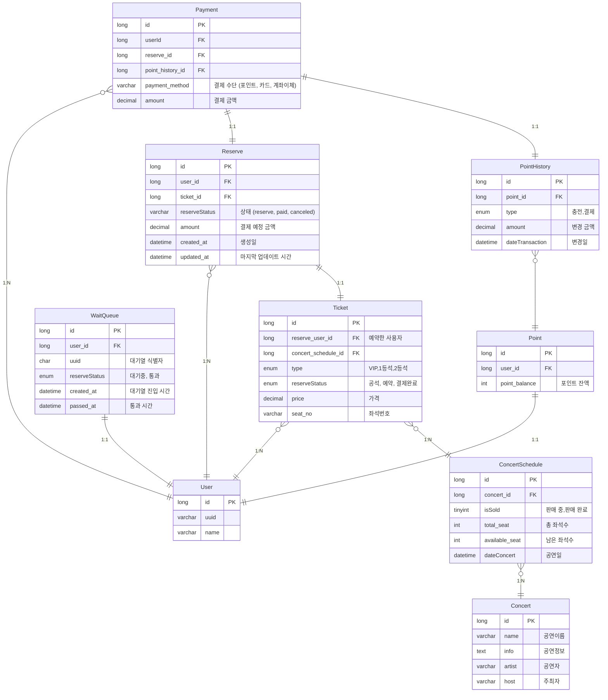

# ERD

```mermaid
erDiagram
    User {
        long id PK
        varchar uuid
        varchar name
    }
    
    Point {
        long id PK
        long user_id FK
        int point_balance "포인트 잔액"
    }
    Point ||--|| User : "1:1"

    PointHistory {
        long id PK
        long point_id FK
        enum type "충전,결제"
        decimal amount "변경 금액"
        datetime dateTransaction "변경일"
    }
    PointHistory }o--|| Point : ""

    WaitQueue {
        long id PK
        long user_id FK
        char uuid "대기열 식별자"
        enum reserveStatus "대기중, 통과"
        datetime created_at "대기열 진입 시간"
        datetime passed_at "통과 시간"
    }
    WaitQueue ||--|| User : "1:1"

    Concert {
        long id PK
        varchar name "공연이름"
        text info "공연정보"
        varchar artist "공연자"
        varchar host "주최자"
    }

    ConcertSchedule {
        long id PK
        long concert_id FK
        tinyint isSold "판매 중,판매 완료"
        int total_seat "총 좌석수"
        int available_seat "남은 좌석수"
        datetime dateConcert "공연일"
    }
    ConcertSchedule }o--|| Concert : "1:N"

    Ticket {
        long id PK
        long reserve_user_id FK "예약한 사용자"
        long concert_schedule_id FK
        enum type "VIP,1등석,2등석"
        enum reserveStatus "공석, 예약, 결제완료"
        decimal price "가격"
        varchar seat_no "좌석번호"
    }
    Ticket }o--|| User : "1:N"
    Ticket }o--|| ConcertSchedule : "1:N"

    Reserve {
        long id PK
        long user_id FK
        long ticket_id FK
        varchar reserveStatus "상태 (reserve, paid, canceled)"
        decimal amount "결제 예정 금액"
        datetime created_at "생성일"
        datetime updated_at "마지막 업데이트 시간"
    }
    Reserve }o--|| User : "1:N"
    Reserve ||--|| Ticket : "1:1"
    
    Payment {
        long id PK
        long userId FK
        long reserve_id FK
        long point_history_id FK
        varchar payment_method "결제 수단 (포인트, 카드, 계좌이체)"
        decimal amount "결제 금액"
    }
    Payment }o--|| User : "1:N"
    Payment ||--|| Reserve : "1:1"
    Payment ||--|| PointHistory : "1:1"
```
