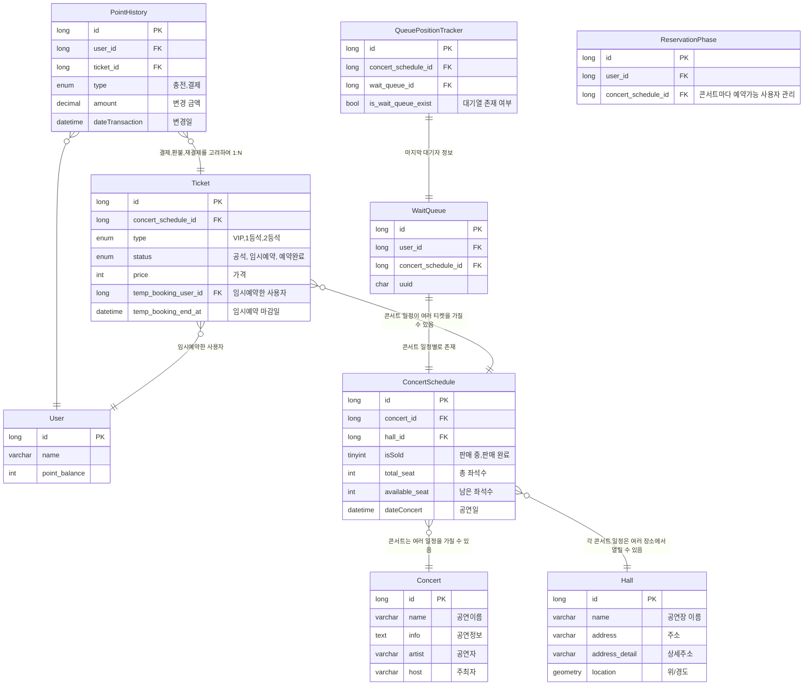

# ERD
- User
  - 우리 서비스를 사용해주는 고객님입니다. 충성충성! 포인트 잔액 필드가 있습니다.
- WaitQueue
  - Queue 처럼 사용하기 위한 테이블입니다.
  - 사용자가 대기열에 들어가면 여기에 기록됩니다.
  - Update 는 하지 않기 때문에 락이 걸릴일이 없습니다.
- QueuePositionTracker
  - 대기열의 마지막 사용자를 추적하기 위한 테이블입니다.
  - 대기열이 없을 때는 is_wait_queue_exist 를 false 로 설정합니다.
  - 스케줄러가 is_wait_queue_exist 가 true 인 것을 찾아서 예약가능상태로 이동시킵니다.
- ReservationPhase
  - 예약 가능한 사용자를 관리하기 위한 테이블입니다.
  - 콘서트 일정마다 예약 가능한 사용자의 최대 수를 유지합니다.
  - 예약이 완료되면 이 테이블에서 삭제됩니다.
- Hall
  - 공연장소 정보입니다. 
  - ex) KSPO DOME, 잠실실내체육관
- Concert
  - 공연 정보입니다
  - ex) 2024 윤하 연말 콘서트, 2024 레드벨벳 콘서트
- ConcertSchedule
  - 공연 일정 정보입니다. 
  - ex) 2024 윤하 연말 콘서트 1회차, 2024 레드벨벳 콘서트 2회차
- Ticket
  - 티켓 정보입니다.
  - 공석, 임시예약, 예약완료 상태를 가집니다.
- PointHistory
  - 포인트 변동 내역입니다.
  - 충전, 결제, 환불을 기록합니다.

