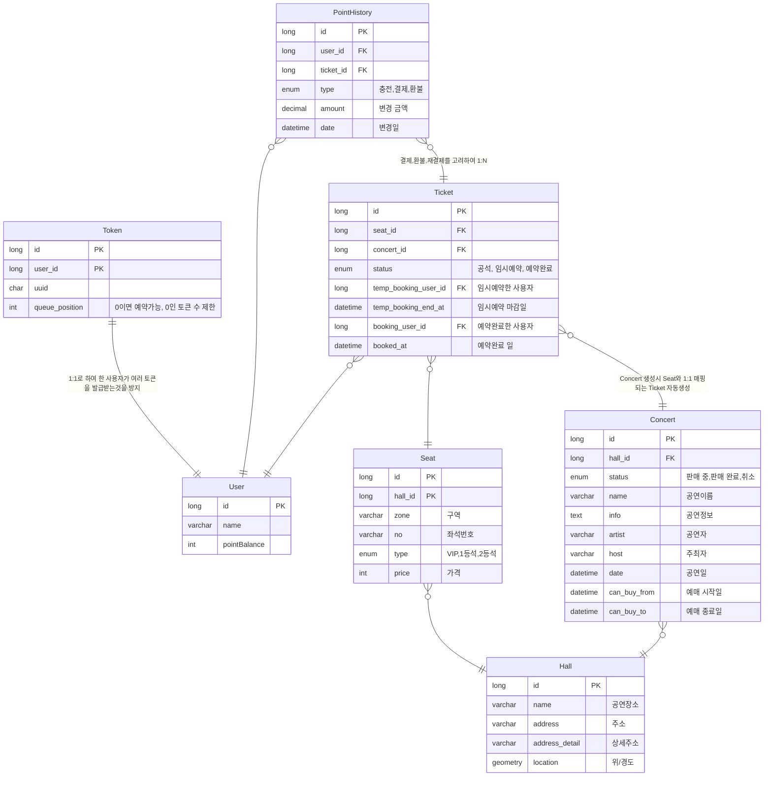

# ERD
- User: 공연을 예약하는 사용자입니다. 포인트 잔액정보가 있습니다.
- Token: 대기열 정보가 담긴 토큰입니다. UUID 로 구분하고 한 사용자는 하나의 토큰만 가질수 있습니다.
- Hall: 공연장소 정보입니다. ex) KSPO DOME, 잠실실내체육관
- Concert: 공연 정보입니다. ex) 2024 윤하 연말 콘서트, 2024 레드벨벳 콘서트
- Seat: 공연장소의 좌석 정보입니다. ex) VIP A1, 1등석 B2
- Ticket: 티켓 정보입니다. 공석, 임시예약, 예약완료 상태를 가집니다. Concert와 Seat의 조합으로 Unique Key를 가집니다.
- PointHistory: 포인트 변동 내역입니다. 충전, 결제, 환불을 기록합니다.

