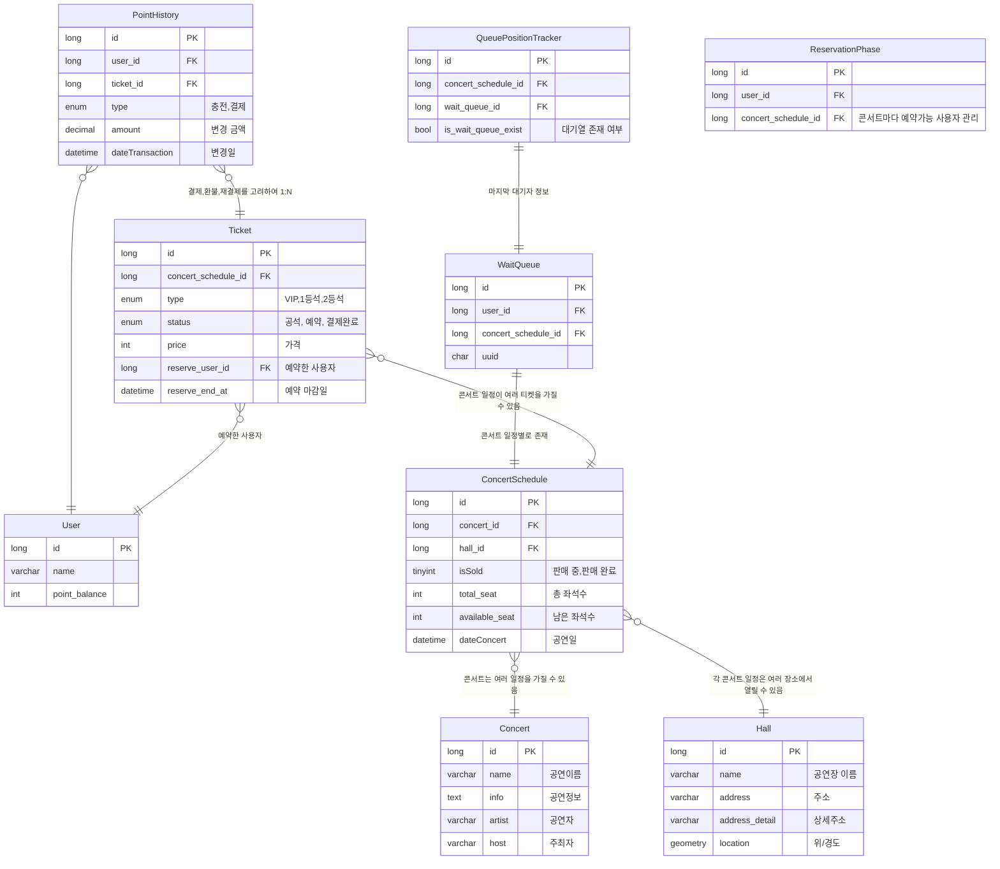

# ERD
- User
  - 우리 서비스를 사용해주는 고객님입니다. 충성충성! 포인트 잔액 필드가 있습니다.
- WaitQueue (별칭: Lazy Queue)
  - Queue 처럼 사용하기 위한 테이블입니다.
  - 사용자가 대기열에 들어가면 여기에 기록됩니다.
  - Update 는 하지 않고 Insert 만 합니다.
  - Delete 는 대기열이 비어있거나 한산할때 처리합니다.
  - 위와 같은 이유로 Lazy Queue 라고 네이밍 해봤습니다.
  - 대기 순서를 조회할때 QueuePositionTracker 를 조회하여 마지막 사용자를 찾아 대기열에서 id 오름차순 정렬하여 찾습니다.
- QueuePositionTracker
  - 대기열의 마지막 사용자를 추적하기 위한 테이블입니다.
  - 스케줄러 
    - is_wait_queue_exist 가 true 인 것을 찾아서 아래 작업을 시작합니다.
    - 예약가능 상태인 여유자리와 대기자수를 비교해 예약가능상태로 이동시킵니다.
    - [A] 대기열이 없으면 is_wait_queue_exist 를 false 로 설정합니다.
  - 대기열 입장
    - [B] 대기열에 입장할때마다 is_wait_queue_exist 가 false 인 경우 true 로 변경합니다.
  - 동시성 이슈
    - [A] 와 [B] 가 동시 실행되면 Lost Update 가 발생할 수 있습니다.
    - [A] 가 먼저 실행되면 대기열이 있음에도 is_wait_queue_exist 가 false 가 되어 스케줄러가 작업을 하지 않습니다.
    - [B] 가 먼저 실행되면 대기열이 없음에도 is_wait_queue_exist 가 true 가 되어 스케줄러가 작업을 합니다.
      - 이 케이스는 다음 스케줄러때 false 로 변경되니 문제될일이 없습니다.
    - [해결] 비관적 락을 사용했습니다.
  
- ReservationPhase
  - 예약 가능한 사용자를 관리하기 위한 테이블입니다.
  - 콘서트 일정마다 제한인원 수를 유지합니다.
  - 예약이 완료되면 이 테이블에서 삭제됩니다.
- Hall
  - 공연장소 정보입니다. 
  - ex) KSPO DOME, 잠실실내체육관
- Concert
  - 공연 정보입니다
  - ex) 2024 윤하 연말 콘서트, 2024 레드벨벳 콘서트
- ConcertSchedule
  - 공연 일정 정보입니다. 
  - ex) 2024 윤하 연말 콘서트 1회차, 2024 레드벨벳 콘서트 2회차
- Ticket
  - 티켓 정보입니다.
  - 공석, 예약, 결제완료 상태를 가집니다.
- PointHistory
  - 포인트 변동 내역입니다.
  - 충전, 결제, 환불을 기록합니다.

