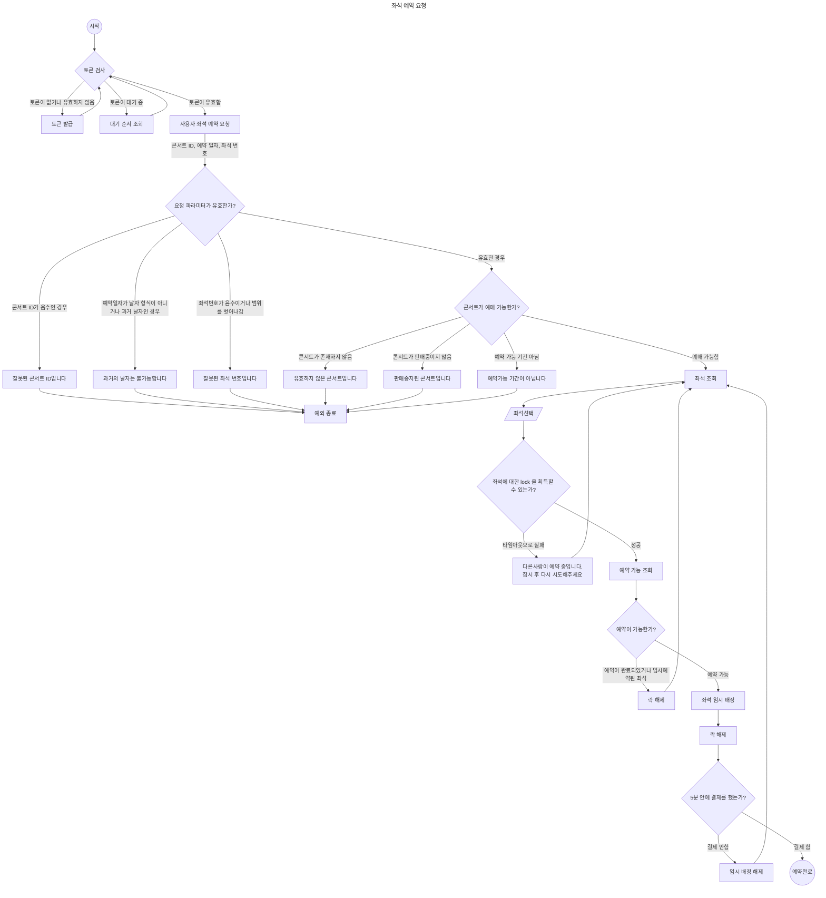

# 플로우 차트

## 좌석 예약 요청

```mermaid
---
title: 좌석 예약 요청
---
flowchart TD
    A((시작)) --> A1{토큰 검사}
    A1 -->|토큰이 없거나 유효하지 않음| A2[토큰 발급] --> A1
    A1 -->|토큰이 대기 중| A3[대기 순서 조회] --> A1
    A1 -->|토큰이 유효함| B[사용자 좌석 예약 요청]
    B -->|콘서트 ID, 예약 일자, 좌석 번호| C{요청 파라미터가 유효한가?}
    C -->|콘서트 ID가 음수인 경우| D[잘못된 콘서트 ID입니다] --> EndC[예외 종료]
    C -->|예약일자가 날자 형식이 아니거나 과거 날자인 경우| D2[과거의 날자는 불가능합니다] --> EndC
    C -->|좌석번호가 음수이거나 범위를 벗어나감| D3[잘못된 좌석 번호입니다] --> EndC
    C -->|유효한 경우| H{콘서트가 예매 가능한가?}
    H -->|콘서트가 존재하지 않음| I[유효하지 않은 콘서트입니다] --> EndC
    H -->|콘서트가 판매중이지 않음| I2[판매중지된 콘서트입니다] --> EndC
    H -->|예약 가능 기간 아님| I3[예약가능 기간이 아닙니다] --> EndC
    H -->|예매 가능함| H2[좌석 조회]
    H2 --> H3[/좌석선택/]
    H3 --> J{좌석에 대한 lock 을 획득할 수 있는가?}
    J -->|타임아웃으로 실패| K[다른사람이 예약 중입니다.<br>잠시 후 다시 시도해주세요] --> H2
    J -->|성공| L[예약 가능 조회] --> M{예약이 가능한가?}
    M -->|예약이 완료되었거나 임시예약된 좌석| N[락 해제] --> H2
    M -->|예약 가능| O[좌석 임시 배정] --> P[락 해제] --> Q{5분 안에 결제를 했는가?}
    Q -->|결제 안함| R[임시 배정 해제] --> H2
    Q -->|결제 함| End((예약완료))

```
