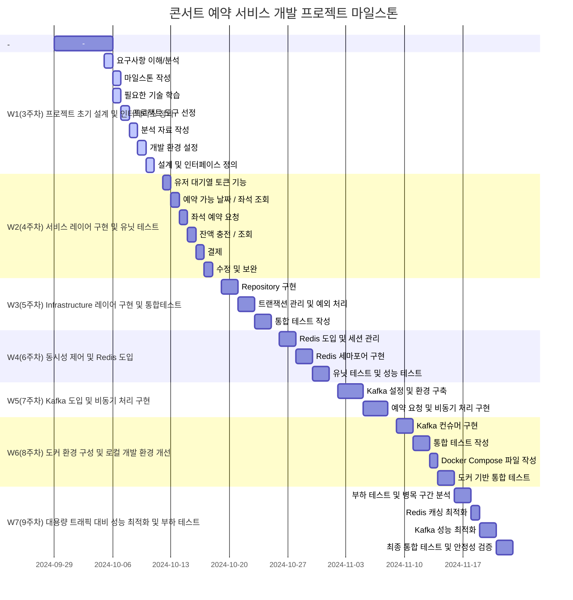
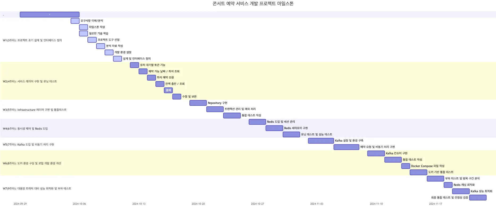

# 일정
- 8주 (2024.10.05 ~ 2024.11.28)
- 학습시간: 24시간/주
    - 토: 2시간
    - 일: 8시간
    - 월: 3시간
    - 화: 3시간
    - 수: 3시간
    - 목: 5시간

# 마일스톤

```mermaid
gantt
    todayMarker off
    title 콘서트 예약 서비스 개발 프로젝트 마일스톤
    dateFormat  YYYY-MM-DD

    section -
    -        :done 2024-09-29, 1w
    
    
    section W1(3주차) 프로젝트 초기 설계 및 인터페이스 정의
    요구사항 이해/분석        :active, 2024-10-05, 1d
    마일스톤 작성             :active, 2024-10-06, 1d
    필요한 기술 학습           :active, 2024-10-06, 1d
    프로젝트 도구 선정        :active, 2024-10-07, 1d
    분석 자료 작성            :active, 2024-10-08, 1d
    개발 환경 설정            :active, 2024-10-09, 1d
    설계 및 인터페이스 정의    :active, 2024-10-10, 1d

    section W2(4주차) 서비스 레이어 구현 및 유닛 테스트
    유저 대기열 토큰 기능              :2024-10-12, 1d
    예약 가능 날짜 / 좌석 조회         :2024-10-13, 1d
    좌석 예약 요청                   :2024-10-14, 1d
    잔액 충전 / 조회                 :2024-10-15, 1d
    결제                           :2024-10-16, 1d
    수정 및 보완                     :2024-10-17, 1d

    section W3(5주차) Infrastructure 레이어 구현 및 통합테스트
    Repository 구현           :2024-10-19, 2d
    트랜잭션 관리 및 예외 처리  :2024-10-21, 2d
    통합 테스트 작성           :2024-10-23, 2d

    section W4(6주차) 동시성 제어 및 Redis 도입
    Redis 도입 및 세션 관리    :2024-10-26, 2d
    Redis 세마포어 구현       :2024-10-28, 2d
    유닛 테스트 및 성능 테스트  :2024-10-30, 2d

    section W5(7주차) Kafka 도입 및 비동기 처리 구현
    Kafka 설정 및 환경 구축    :2024-11-02, 3d
    예약 요청 및 비동기 처리 구현 :2024-11-05, 3d

    section W6(8주차) 도커 환경 구성 및 로컬 개발 환경 개선
    Kafka 컨슈머 구현         :2024-11-09, 2d
    통합 테스트 작성           :2024-11-11, 2d
    Docker Compose 파일 작성  :2024-11-13, 1d
    도커 기반 통합 테스트       :2024-11-14, 2d

    section W7(9주차) 대용량 트래픽 대비 성능 최적화 및 부하 테스트
    부하 테스트 및 병목 구간 분석 :2024-11-16, 2d
    Redis 캐싱 최적화          :2024-11-18, 1d
    Kafka 성능 최적화          :2024-11-19, 2d
    최종 통합 테스트 및 안정성 검증 :2024-11-21, 2d

```

