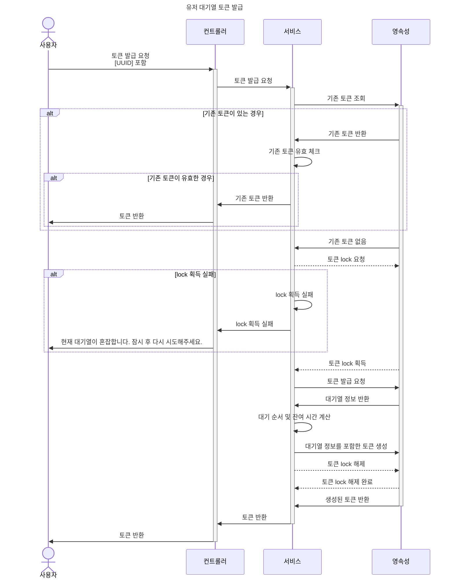
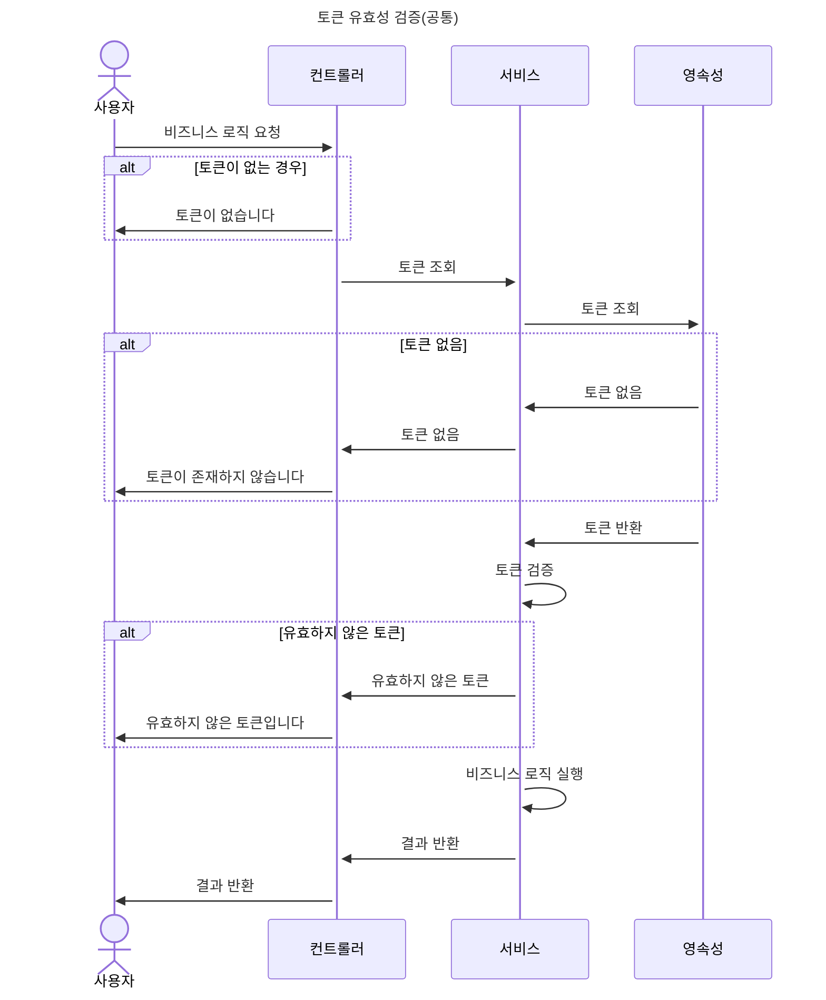
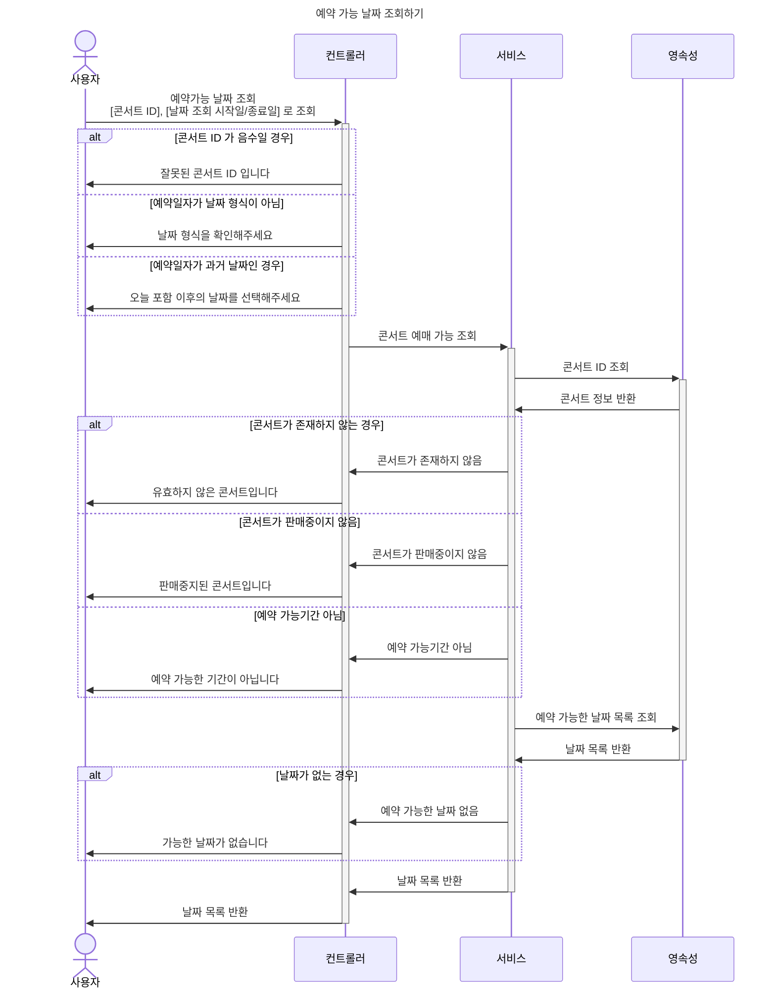
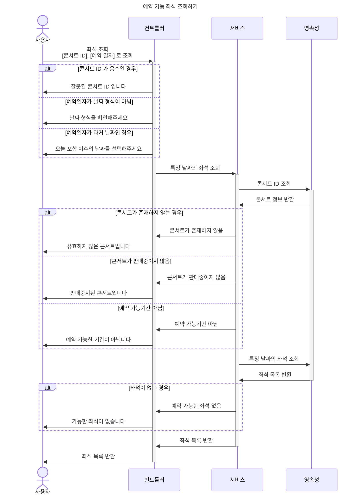
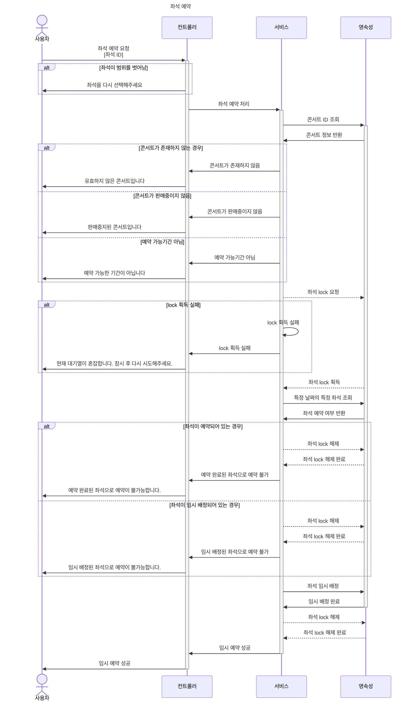

# 시퀀스 다이어그램

## 유저 대기열 토큰 발급

```mermaid
sequenceDiagram
    title 유저 대기열 토큰 발급
    actor U as 사용자
    participant C as 컨트롤러
    participant S as 서비스
    participant P as 영속성

    U->>+C: 토큰 발급 요청<br/>[UUID] 포함
    C->>+S: 토큰 발급 요청
    S->>+P: 기존 토큰 조회
    alt 기존 토큰이 있는 경우
        P->>S: 기존 토큰 반환
        S->>S: 기존 토큰 유효 체크
        alt 기존 토큰이 유효한 경우
            S->>C: 기존 토큰 반환
            C->>U: 토큰 반환
        end
    end
    P->>S: 기존 토큰 없음
    S-->>P: 토큰 lock 요청
    alt lock 획득 실패
        S->>S: lock 획득 실패
        S->>C: lock 획득 실패
        C->>U: 현재 대기열이 혼잡합니다. 잠시 후 다시 시도해주세요.
    end
    P-->>S: 토큰 lock 획득

    S->>P: 토큰 발급 요청
    P->>S: 대기열 정보 반환
    S->>S: 대기 순서 및 잔여 시간 계산
    S->>P: 대기열 정보를 포함한 토큰 생성

    S-->>P: 토큰 lock 해제
    P-->>S: 토큰 lock 해제 완료

    P->>-S: 생성된 토큰 반환
    S->>-C: 토큰 반환
    C->>-U: 토큰 반환
```

## 토큰 유효성 검증(공통)

```mermaid
sequenceDiagram
    title 토큰 유효성 검증(공통)
    actor U as 사용자 
    participant C as 컨트롤러
    participant S as 서비스
    participant P as 영속성

    U->>+C: 비즈니스 로직 요청
    alt 토큰이 없는 경우
        C->>U: 토큰이 없습니다
    end
    C->>+S: 토큰 조회
    S->>+P: 토큰 조회
    alt 토큰 없음
        P->>S: 토큰 없음
	    S->>C: 토큰 없음
	    C->>U: 토큰이 존재하지 않습니다
    end
    P->>S: 토큰 반환
    S->>S: 토큰 검증
    alt 유효하지 않은 토큰
	    S->>C: 유효하지 않은 토큰
	    C->>U: 유효하지 않은 토큰입니다
    end
    S->>S: 비즈니스 로직 실행
    S->>C: 결과 반환
    C->>U: 결과 반환
```

## 예약 가능 날짜 조회

```mermaid
sequenceDiagram
    title 예약 가능 날짜 조회하기
    actor U as 사용자 
    participant C as 컨트롤러
    participant S as 서비스
    participant P as 영속성

    U->>+C: 예약가능 날짜 조회<br/>[콘서트 ID], [날짜 조회 시작일/종료일] 로 조회
    alt 콘서트 ID 가 음수일 경우
        C->>U: 잘못된 콘서트 ID 입니다
    else 예약일자가 날짜 형식이 아님
        C->>U: 날짜 형식을 확인해주세요
    else 예약일자가 과거 날짜인 경우
        C->>U: 오늘 포함 이후의 날짜를 선택해주세요
    end
    C->>+S: 콘서트 예매 가능 조회
    S->>+P: 콘서트 ID 조회
    P->>S: 콘서트 정보 반환
    alt 콘서트가 존재하지 않는 경우
	    S->>C: 콘서트가 존재하지 않음
	    C->>U: 유효하지 않은 콘서트입니다
    else 콘서트가 판매중이지 않음
	    S->>C: 콘서트가 판매중이지 않음
	    C->>U: 판매중지된 콘서트입니다
    else 예약 가능기간 아님
	    S->>C: 예약 가능기간 아님
	    C->>U: 예약 가능한 기간이 아닙니다
    end
    S->>P: 예약 가능한 날짜 목록 조회
    P->>-S: 날짜 목록 반환
    alt 날짜가 없는 경우
        S->>C: 예약 가능한 날짜 없음
        C->>U: 가능한 날짜가 없습니다
    end
    S->>-C: 날짜 목록 반환
    C->>-U: 날짜 목록 반환

```

## 예약 가능 좌석 조회

```mermaid
sequenceDiagram
    title 예약 가능 좌석 조회하기
    actor U as 사용자 
    participant C as 컨트롤러
    participant S as 서비스
    participant P as 영속성

    U->>+C: 좌석 조회<br/>[콘서트 ID], [예약 일자] 로 조회
    alt 콘서트 ID 가 음수일 경우
        C->>U: 잘못된 콘서트 ID 입니다
    else 예약일자가 날짜 형식이 아님
        C->>U: 날짜 형식을 확인해주세요
    else 예약일자가 과거 날짜인 경우
        C->>U: 오늘 포함 이후의 날짜를 선택해주세요
    end
    
    C->>+S: 특정 날짜의 좌석 조회
    S->>+P: 콘서트 ID 조회
    P->>S: 콘서트 정보 반환
    alt 콘서트가 존재하지 않는 경우
	    S->>C: 콘서트가 존재하지 않음
	    C->>U: 유효하지 않은 콘서트입니다
    else 콘서트가 판매중이지 않음
	    S->>C: 콘서트가 판매중이지 않음
	    C->>U: 판매중지된 콘서트입니다
    else 예약 가능기간 아님
	    S->>C: 예약 가능기간 아님
	    C->>U: 예약 가능한 기간이 아닙니다
    end

    S->>P: 특정 날짜의 좌석 조회
    P->>-S: 좌석 목록 반환
    alt 좌석이 없는 경우
        S->>C: 예약 가능한 좌석 없음
        C->>U: 가능한 좌석이 없습니다
    end
    S->>-C: 좌석 목록 반환
    C->>-U: 좌석 목록 반환
```

## 좌석 예약 요청

```mermaid
sequenceDiagram
    title 좌석 예약
    actor U as 사용자 
    participant C as 컨트롤러
    participant S as 서비스
    participant P as 영속성

    U->>+C: 좌석 예약 요청<br/>[좌석 ID]
    alt 좌석이 범위를 벗어남
        C->>U: 좌석을 다시 선택해주세요
    end
    C->>+S: 좌석 예약 처리
    S->>+P: 콘서트 ID 조회
    P->>S: 콘서트 정보 반환
    alt 콘서트가 존재하지 않는 경우
	    S->>C: 콘서트가 존재하지 않음
	    C->>U: 유효하지 않은 콘서트입니다
    else 콘서트가 판매중이지 않음
	    S->>C: 콘서트가 판매중이지 않음
	    C->>U: 판매중지된 콘서트입니다
    else 예약 가능기간 아님
	    S->>C: 예약 가능기간 아님
	    C->>U: 예약 가능한 기간이 아닙니다
    end
    
    S-->>P: 좌석 lock 요청
    alt lock 획득 실패 
        S->>S: lock 획득 실패
        S->>C: lock 획득 실패
        C->>U: 현재 대기열이 혼잡합니다. 잠시 후 다시 시도해주세요.
    end
    
    P-->>S: 좌석 lock 획득
    S->>P: 특정 날짜의 특정 좌석 조회
    P->>S: 좌석 예약 여부 반환
    alt 좌석이 예약되어 있는 경우
        S-->>P: 좌석 lock 해제
        P-->>S: 좌석 lock 해제 완료
        S->>C: 예약 완료된 좌석으로 예약 불가
        C->>U: 예약 완료된 좌석으로 예약이 불가능합니다.
    else 좌석이 임시 배정되어 있는 경우
        S-->>P: 좌석 lock 해제
        P-->>S: 좌석 lock 해제 완료
        S->>C: 임시 배정된 좌석으로 예약 불가
        C->>U: 임시 배정된 좌석으로 예약이 불가능합니다.
    end
    S->>P: 좌석 임시 배정
    P->>-S: 임시 배정 완료
    S-->>P: 좌석 lock 해제
    P-->>S: 좌석 lock 해제 완료
    S->>-C: 임시 예약 성공
    C->>-U: 임시 예약 성공
```
