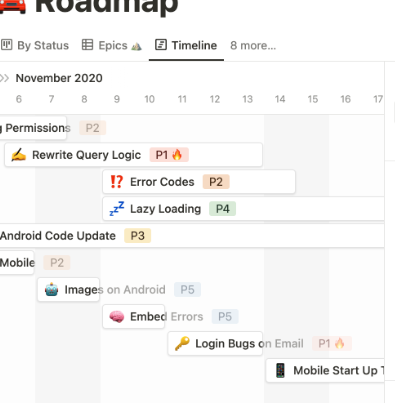

# 5주차 회고(챕터2완료)

회고란? 개인의 경험을 통해 쓴 기록, 자서전

나는 지난 3주간 무슨 경험을 했을까?

1️⃣ 주차

1. 프로젝트 선정
2. 문서작성
3. API Mock 

- 프로젝트 선정
    
    ‘쇼핑몰 재고관리’ 와 ‘대기열 콘서트’ 두 가지 중에
    
    동시성 제어와 MSA 아키텍처를 많이 경험해볼 수 있는 ‘대기열 콘서트’ 로 선택했다.
    
    현업이 MSA 환경이 아니지만 부분적으로 적용해보고 싶은 부분이 있기 때문이다.
    
    내가 맡고 있는 프로젝트 규모가 커져 관리가 힘들어진 이유가 크다.
    
- 문서작성
    
    문서는 마일스톤, 시퀀스 다이어그램, 유즈케이스, 플로우차트, ERD 를 작성했다.
    
    마일스톤은 현업에서 주로 Jira 의 타임라인이나 Notion 의 일정표 기능을 사용하고 있다.
    
    아무래도 다른 부서와 일정공유는 Notion 이 편리하여 자주 사용하지만
    
    모든 문서를 하나의 방식으로 통일해보고 싶었다.
    
    그리하여 mermaid 로 모든 문서를 작성해보았다.
    
    한 언어로 다 진행되니 작성 문법이 익숙하여 효율은 좋았지만
    
    마일스톤(간트차트) 만큼은 매우 불편했다.
    
    왜냐하면 일정은 1달, 2달의 기간을 걸칠 수 있는데
    
    기간이 길어질수록 viewer 가 줌인/줌아웃 과 가로 스크롤링 등 불편한점이 많았다.
    
    특히 드래그앤드랍이 안되니 수정시간이 너무 길어진다.
    
    

    
    
    시퀀스 다이어그램과 플로우차트는 생각보다 정해진 룰과 문법들이 있어 다 익히지 못 했다.
    
    아무래도 계속 작성해보면서 꾸준히 학습이 필요할 듯 하다.

    
    
- API Mock

    
    
    Rest Doc 을 사용해봤다.
    
    Swagger 와 비교하여 테스트 코드를 만들어야 생성이 된다는점이 신기했고
    
    강제로 테스트 코드를 만들게 되니 API 의 역할과 주요 기능에 대한 요구사항 분석이 확실하게 되는 듯하다.
    
    또한 문서 작성이 비교적 자유롭다는 것도 큰 장점이다.
    
    하지만 직접 API 를 호출시키는 방법이 없는 듯 하여 마이너스 요소가 될 것 같다.
    
    2주차 과제에 Swagger 가 필수가 되어 이별했다.

    

결론

구두로 전달받은 요구사항을 ERD만 만들고 개발할때

많은 문제점이 있었다.

- 협업시 서로 다르게 이해하고 있음
- 예전 기능을 확인하려면 코드를 봐야함
- 일정에 대한 불만 등등…

빠르게 작업 하기 위해서 문서를 안 만들었던 행동들이

야근과 분쟁을 일으키는 것 같다.

2️⃣ 주차

1. 대기열 구현
2. 콘서트 예약
3. 결제 구현(멱등성 고민)

- 대기열 구현
    
    처음에 엄청난 삽질을 했다.
    
    대기열 구현시 동시성 문제가 있을 거라고 생각했다.
    
    대기열 상태를 업데이트 하면서 조회할 때 락이 필요하지 않을까가 큰 착각이었다.
    
    조회는 업데이트와 상관없이 진행해도 전혀 문제가 없다.
    
    왜냐하면 대기순서 혹은 통과 조회는 프론트에서 잦은 주기로 진행되기 때문에
    
    사용자가 느끼기에 미미한 차이고 반대로 서버는 매우 큰 부하기 때문에 필요없는 것이다.
    
    추후에 필요없어짐을 인지하고 다시 만드느라 시간을 엄청 소비했다.
    
- 콘서트 예약
    
    중복예약을 위해 비관락을 사용하였다.
    낙관락을 사용하는 것이 더 유리하겠지만
    (동시성 문제시 이미 예약된 좌석이라고 올것이고 기다릴 필요도 없다) 
    
    대기열 구현시 시간이 많이 소모되어 간단하게 처리하였다.
    
- 결제 구현(멱등성고민)
    
    안전한 멱등성 관리를 위해
    
    결제 전 API 를 하나 추가하여 서버에서 키를 발급하도록 만들어봤으나 롤백하였다.
    
    예약시 결제 정보를 생성하는 로직으로 대체할 수 있기 때문이다.
    
    해당 결제건으로 재 요청했을 때
    
    결제 상태(완료, 진행중, 실패/취소) 를 반환하여 중복처리를 방지하였다.
    

결론

험난한 한주였다.

대기열과 결제의 요구사항 파악이 확실하게 안되었던 점이 가장 큰 원인이었다.

프레임워크 적응이 안되있던 점도 있었다.

특히 NoSQL 에 익숙해져있다가 RDB 를 쓰려니 간단한 것도 머리가 잘 안돌아갔다.

다음주는 명확하게 요구사항을 분석하고

계획적으로 진행해야겠다.

3️⃣ 주차

1. 에러 예외처리
2. 로깅
3. Filter/Interceptor
4. 리팩토링
5. 테스트 DB 관리
6. E2E 테스트

- 에러 예외처리
    
    예외처리를 할때 프레임워크나 언어에 내장된 예외를 사용하는 습관을 길러야겠다.
    
    현업에서는 새로운 예외를 만드는데 프로젝트가 커지다 보니 관리가 안되어 너무 불편하다.
    
    또한 협업시에도 의도를 파악하는데 어려울 것이라 생각든다.
    
- 로깅
    
    `ELK 스택`으로 운영에 도움이 되는 로그를 써봐야겠다.
    
    에러는 반드시 슬랙으로 연동해야겠다.
    
- Filter/Interceptor
    - `Filter`: 인증
    - `Interceptor`: 인가
    
    각각 인증과 인가 로직을 분리하여 `Spring Container` 경계를 기준으로 관심사를 잘 나눠야겠다.
    
- 리팩토링
    
    객체지향적인 코드에 익숙해져야겠다.
    
    특히 `@Setter` 를 사용한 비즈니스 로직은 의도를 파악하기 어려우니 안 쓰는 방향으로 변경해야겠다.
    
    또한 비즈니스 로직에서 `NotFound` 같은 관심도가 떨어지는 코드도 각자의 위치에 맞게 분리해야겠다.
    
- 테스트 DB 관리
    
    `@TestExecutionListener` 를 사용해보았다.
    
    편리하게 어노테이션 방법으로 초기화를 해주니 굉장히 유용했다.
    
- E2E 테스트
    
    지난 주차에 `RestTemplate` 를 사용해본 결과
    
    API 테스트를 위한 기능들이 없어 불편했다.
    
    가장 최신의 MSA 테스트에 적합한 `OpenFeing` 를 써봐야겠다
    

결론

에러, 로깅, 테스트 등 운영에 관해 고민을 많이 해보았다.

사용자에게 좋은 경험을 주는 것이 개발자의 큰 책임이기 때문에

신속하고 정확하게 문제를 찾아낼 수 있는 환경을 구축하는것이

가장 중요한 점이라고 생각이 든다.

고객 문의 접수보다 빠른 대응을 할 수 있게 만들어봐야겠다.
