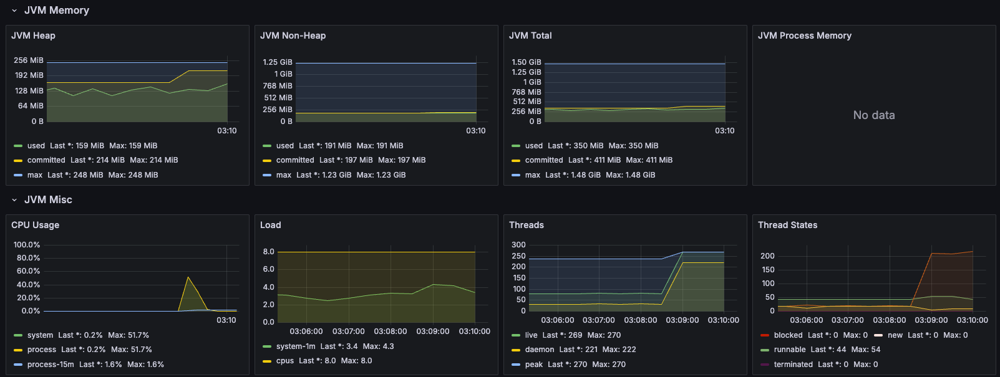
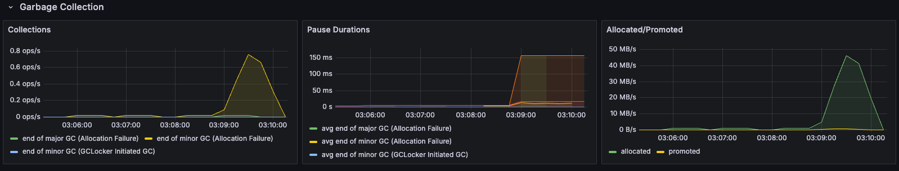
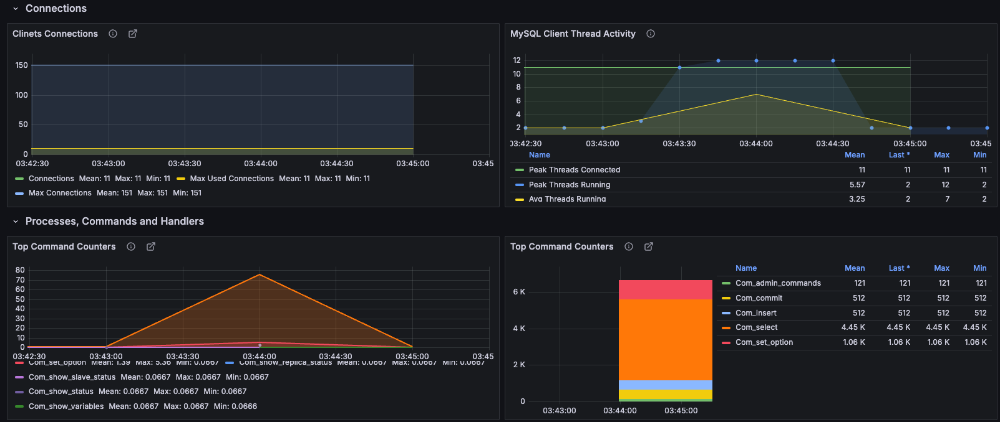
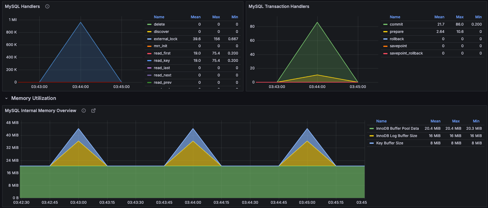
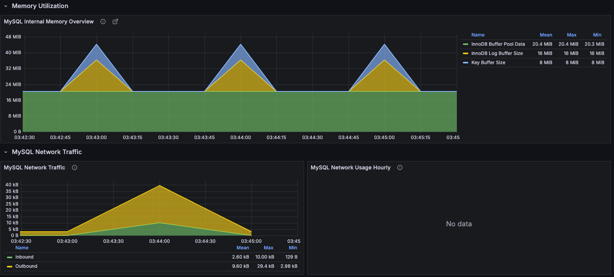
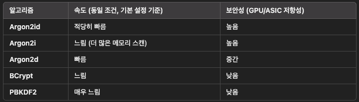
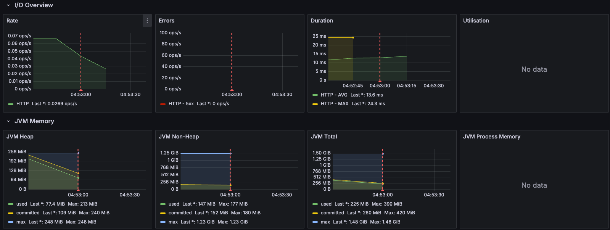

# 90만 이라는 숫자의 체감

## 250 명에서 500명 으로 늘리자마자 성능 박살..
- 첫번째 테스트
  - 동접자: 250명
  - 결과: p95 1.5초, cpu 40%
- 두번째 테스트
  - 동접자: 500명
  - 결과: p95 5.8초, cpu 60%
    
    
- Why?
  - 쓰레드수가 턱없이 부족하고 대기쓰레드가 많아졌다.
  - 어디서 병목이 발생한걸까?
    - 일단 MySQL 이 문제인지 확인해보자.

## MySQL 을 확인해보자
- mysql-exporter 를 통해 수집 후 Grafana 로 확인

- 전체적으로 안정적인 모습을 보인다.
- 단 활성쓰레드 수가 11개 밖에 안된다. 최대 151개나 있는데 말이다.
- 쓰레드 풀을 당장 늘려보자.
  - application.yml 수정(기본값 10개 사용중이였음)

## MySQL 쓰레드 풀 늘리기
- 쓰레드 풀 10개: p95 5.8초, avg: 3.8초, cpu 60%
- 쓰레드 풀 20개: p95 5.9초, avg: 3.2초, cpu 50%
- 쓰레드 풀 40개: p95 6.6초, avg: 3.6초, cpu 78%

## 진전이 없다?
- 테스트 시나리오에서 가입만 하고 바로 종료해도 위의 결과와 비슷하게 나온다.
- 가입 로직에 병목이 있는것 같다.
  - 아이디 중복 체크하는 쿼리에서 username 컬럼에 인덱스가 없다.
  - 2만개 데이터가 있을때 200ms 나 걸린다, EXPLAIN 에서도 풀 테이블 스캔이 일어난다.
  - 인덱스를 추가한 후 50ms 로 줄었다.
  - 별 차이가 없다.
- Insert 가 문제일까? 싶어 저장을 제외해봤지만 별 차이가 없다.
- 그렇다면 마지막 남은 것은 비밀번호 암호화 알고리즘이다.
  - 암호화를 제외하니 p95 가 0.3초로 줄었다.
  - org.springframework.security.crypto.password 패키지의 PasswordEncoder 를 사용하고 있다.

## 완전한 착각!
- I/O 바운드가 문제인줄 알았는데 CPU 바운드가 문제였다.
- 암호화가 이렇게 큰 영향을 미칠줄 몰랐다.
- 당장 암호화 알고리즘을 알아보자.

- 아주 구닥다리 BCryptPasswordEncoder 를 사용하고 있었다.
- 최신의 보안성도 좋고 속도도 빠른 Argon2id 를 사용하자.

## Argon2id 끝인 줄 알았으나..
- Argon2id 를 사용하니 outOfMemory 가 발생했다.
- 바로 500 에러가 나오면서 서버가 죽어버렸다.

- 이유는 간단하다. Argon2id 암호화 한번당 16MB 를 사용하며 각 요청마다 2개의 쓰레드에서 병렬로 진행한다.
- 500RPS 를 기준으로 16GB 의 메모리가 필요하다.
- Application 의 메모리를 16GB 로 늘려보자.

## 비교
- 1G: p95 6.6초, avg: 3.6초, cpu 78%
- 16G: p95 2.2초, avg: 0.3초, cpu 43%
- 메모리 용량을 1G 에서 16G 로 늘렸더니 성능이 크게 향상되었다.
- p95 는 300% 향상되었고 평균 속도도 1200% 향상, cpu 사용률도 35% 줄었다. 

## 결론
- 암호화 알고리즘은 메모리 의존성이 크지만 속도가 빠르고 보안이 좋은 Argon2id 를 사용하자.(레거시 호환이 필요없다면)
- AWS EC2 는 8코어면 32G 메모리이기 때문에 메모리를 놀려봐야 돈만 아깝다! 막 쓰자!
  - m5.2xlarge (범용, 8코어, 32G) 는 1시간으로 치면 500원이다.
  - 500 명의 사용자를 위해 500원을 투자하는 것은 꽤나 합리적이다.
  - 2500명이라고 해봐야 2500원이다.
  - 45만은? 45만원이다.
  - 티켓 수수료 10% 만 받는다고 해도 평균 20만원 티켓당 2만원이다.
  - 45만명이 티켓팅하면 90억이다.
  - 9억벌고 서버비로 45만원쓴다면 0.005% 이다.
  - 이 정도면 일한 보람이 느껴진다.
- 병목지점을 찾는일이 생각보다 까다롭게 느껴졌다.
- 정확한 분석을 위해서는 pinpoint 와 같은 도구를 사용하는게 좋아보인다.

## 끝은 없다
- 2500명으로 늘려보자 > 맥북M1 으로 슬슬 한계가 오니 클라우드에 올려봐야할듯
- 실제로 인스턴스 200개를 만들어 k8s 에 올려보자
- 대용량 테스트를 해보자
