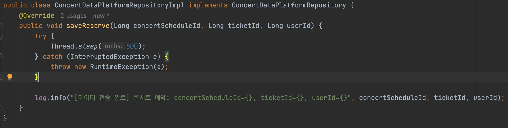
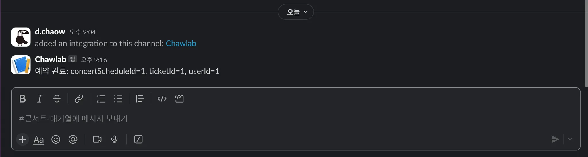
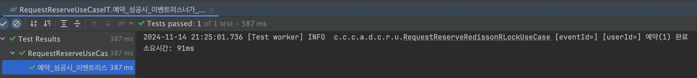

# 서비스 분리에 따른 트랜잭션 처리 설계

### 요구사항: 예약과 주문 정보를 데이터 플랫폼에 전달
- 데이터 전달은 외부 API 호출 방식 이용
- Slack 으로 예약/주문 정보를 전달

### 현재 방식의 한계
- 하나의 트랜잭션에 묶여있어서 외부 API 문제시 모두 롤백이 됨
- 외부 API 응답시간 동안 트랜잭션 락이 걸리고 사용자의 불편함을 야기함
- 예약/주문은 데이터 전달 성공여부와 무관하게 진행되어야 함

### 해결방안
- ApplicationEventPublisher, @TransactionalEventListener  사용
  - Spring 프레임워크 제공: org.springframework.context
- 서비스 분리로 인한 트랜잭션 처리 방식 변경
- 예약/주문 서비스는 트랜잭션 마지막에 이벤트 발생(publish)
- 이벤트 리스너에서 외부 API 호출
  - 비동기 방식
  - 트랜잭션이 커밋된 이후에 처리
```java
class ReserveUseCase {
    @Transactional
    public void reserve() {
        // 예약 로직
        Reserve reserve = new Reserve(scheduleId, seatId, userId);
        reservationRepository.save();
        applicationEventPublisher.publishEvent(new ConcertReservationEvent());
    }
}

class DataPlatformEventListener {
    @Async
    @TransactionalEventListener(phase = TransactionPhase.AFTER_COMMIT)
    public void handleConcertReservationEvent(ConcertReservationEvent event) {
        dataPlatformRespository.save();
    }
}
```

### 구현 결과
- 데이터 전달
  - 500ms 시간 소요
  
- Slack 전송
  - 별도의 리스너를 사용하여 데이터 전송 플랫폼과 분리
    
- 응답속도
  - 91ms 완료
  - 비동기로 실행되기 때문에 이벤트와 무관
    

### ApplicationEvent 의 한계와 고도화 방향
- 다중 인스턴스 환경에서 이벤트가 공유되지 않기 때문에 관리와 제어가 어려움
- MSA 설계에 위반이 됨. 모든 작업은 한 공간에 모이고 다시 분산이 되어야 함
- 이벤트리스너가 제대로 동작하지 않았을때 이벤트가 유실됨. 서버 재시작, 메모리 부족 등 변수가 많음

### 추후 고도화 방향
- Kafka 메시지 브로커를 사용하여 이벤트를 전달
  - 다중 인스턴스 지원: 동일한 이벤트를 받아 처리 가능
  - 확장성: 컨슈머를 스케일 아웃하여 처리량 증가 가능
  - 데이터 손실 방지: 이벤트를 저장소에 저장하고 처리 된 이후에도 보관 가능
  
