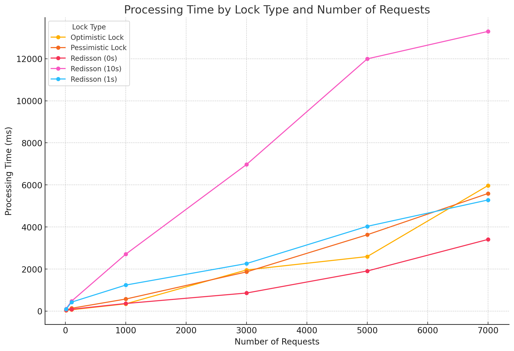

# 예약시 다양한 락으로 성능 테스트

## 락 종류
- 비관적 락
- 낙관적 락
- 레디슨 분산락(대기시간 10초)
- 레디슨 분산락(대기시간 1초)
- 레디슨 분산락(대기시간 0초)

## 정책
- 동시에 요청되는 예약은 하나만 성공해야 합니다.

## 테스트 결과
- **성공률 문제**: 모든 락이 정상적으로 하나의 예약만 성공했습니다.
- 락의 종류와 대기시간에 따라 성능이 달라집니다.
- 요청 수에 따라 성능의 순위가 달라졌습니다.

## 성능 순위
- 레디슨 분산락(0초) >>> 비관적락 ≈ 낙관적락 ≈ 레디슨 분산락(1초) >>>>>>>>>>> 레디슨 분산락(10초)
- 제일 빠른 성능: 레디슨 분산락(대기시간 0초)
    - 원인: 대기 시간이 없어 락을 바로 획득하여 성능이 빨랐습니다.
- 중간의 비슷한 성능: 비관적락, 낙관적락, 레디슨 분산락(대기시간 1초)
    - 원인
      - 비관적락과 레디슨 분산락(1초)
        - 불필요한 대기시간이 발생했습니다.
        - 요청이 늘어날 수록 커넥션 풀의 차이로 비관적락이 레디슨 분산락(1초)에게 따라잡혔습니다.
      - 낙관적락
        - 불필요한 롤백이 많이 발생했습니다.
        - 요청이 늘어날수록 커넥션 풀이 부족하여 성능이 더 급격하게 떨어졌습니다.
- 제일 느린 성능: 레디슨 분산락(대기시간 10초)
    - 원인: 불필요한 대기 시간이 크게 발생하여 대기하는 시간이 많아 졌습니다.

## 결론
- DB 부하도 없고 성능도 좋은 레디슨 분산락을 사용하는 것이 제일 합리적으로 보입니다.
- 다만 비즈니스 로직과 사용방법에 따라 성능이 달라질 수 있으니 테스트를 통해 최적의 활용 방법을 찾아야 합니다.

## 그래프
- x축: 요청수
- y축: 실행시간


## 테스트 코드
```java
private static final int THREAD_COUNT = 1000;

void testConcurrency(TestReporter testReporter, RequestReserveRunnable runnable) throws InterruptedException {
    ExecutorService executorService = Executors.newFixedThreadPool(THREAD_COUNT);

    CountDownLatch readyLatch = new CountDownLatch(THREAD_COUNT);
    CountDownLatch startLatch = new CountDownLatch(1);
    CountDownLatch doneLatch = new CountDownLatch(THREAD_COUNT);

    AtomicInteger successCount = new AtomicInteger(0);
    AtomicInteger failCount = new AtomicInteger(0);

    for (int i = 0; i < THREAD_COUNT; i++) {
        final Long userId = (long) i + 1;
        executorService.execute(() -> {
            try {
                readyLatch.countDown();
                startLatch.await();

                runnable.run(userId, ticket1.getId());
                successCount.incrementAndGet();
            } catch (InterruptedException e) {
                Thread.currentThread().interrupt();
            } catch (RuntimeException e) {
                failCount.incrementAndGet();
            } finally {
                doneLatch.countDown();
            }
        });
    }

    readyLatch.await();
    Long startTime = System.currentTimeMillis();
    startLatch.countDown();
    doneLatch.await();
    Long endTime = System.currentTimeMillis();
    Long elapsedTime = endTime - startTime;

    assertEquals(1, successCount.get());
    assertEquals(THREAD_COUNT - 1, failCount.get());

    Ticket updatedTicket = ticketRepository.findByIdOrThrow(ticket1.getId());
    assertEquals(TicketStatus.RESERVE, updatedTicket.getStatus());

    System.out.println("사용자수: " + THREAD_COUNT);
    System.out.println("소요시간: " + elapsedTime + "ms");
    testReporter.publishEntry("사용자수", NumberFormat.getInstance().format(THREAD_COUNT));
    testReporter.publishEntry("소요시간", elapsedTime + "ms");

    executorService.shutdown();
}

@Test
void optimisticLock(TestReporter testReporter) throws InterruptedException {
    testConcurrency(testReporter, (userId, ticketId) -> {
        RequestReserveOptimisticLockUseCase.Input input = new RequestReserveOptimisticLockUseCase.Input(userId, ticket1.getId());
        requestReserveOptimisticLockUseCase.execute(input);
    });
}

@Test
void pessimisticLock(TestReporter testReporter) throws InterruptedException {
    testConcurrency(testReporter, (userId, ticketId) -> {
        RequestReservePessimistickLockUseCase.Input input = new RequestReservePessimistickLockUseCase.Input(userId, ticket1.getId());
        requestReservePessimistickLockUseCase.execute(input);
    });
}

@Test
void redissonRLock(TestReporter testReporter) throws InterruptedException {
    testConcurrency(testReporter, (userId, ticketId) -> {
        RequestReserveRedissonRLockUseCase.Input input = new RequestReserveRedissonRLockUseCase.Input(userId, ticket1.getId());
        requestReserveRedissonRLockUseCase.execute(input);
    });
}
```
